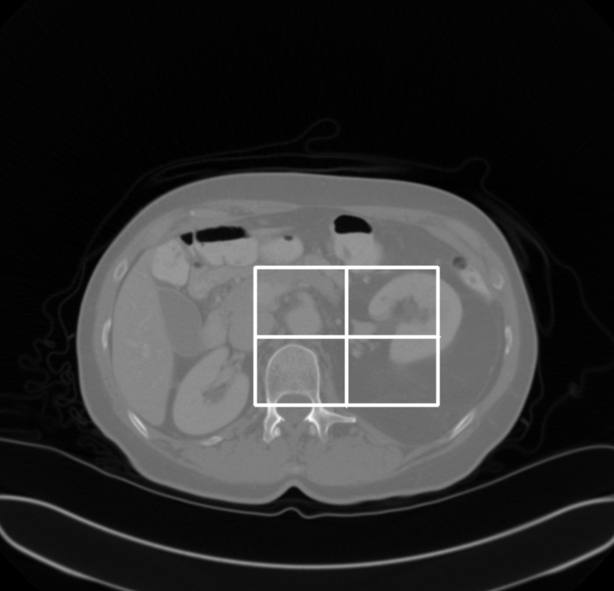
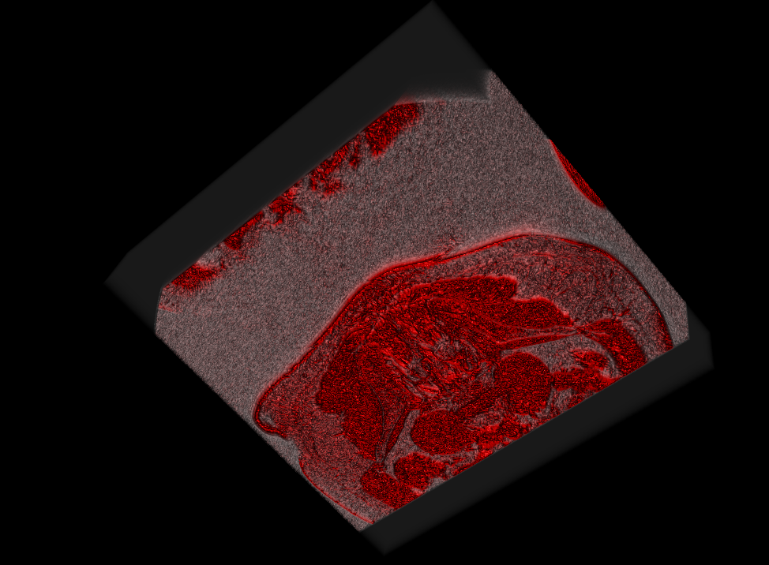

# 🏥 Medical Imaging Tool 🖼️

🚀 **A Python-based DICOM Viewer & Segmentation Tool**  
This application allows users to **upload, view, segment, and process** medical X-ray images in **2D and 3D**.  

## 🌟 Features  
✅ Load **single or series DICOM files**  
✅ View images **in 2D or 3D (VTK rendering)**  
✅ Apply **interactive segmentation & ROI selection**  
✅ Extract and display **DICOM metadata**  
✅ Save segmented images in **PNG or DICOM format**  
✅ **Fully tested with CI/CD (GitHub Actions)**  

---

## 📷 **Screenshots**
**DICOM Image Viewer:**  


**3D Volume Rendering:**  


---

## 📥 **Installation & Setup**
### 🔹 **1️⃣ Clone the Repository**  
```bash
git clone https://github.com/Vickyapril/medical-imaging-tool.git
cd medical-imaging-tool

Set Up a Virtual Environment (Optional but Recommended)

python3 -m venv venv
source venv/bin/activate  # Mac/Linux
venv\Scripts\activate  # Windows

Install Dependencies

pip install -r requirements.txt

Run the Application

python app/gui.py